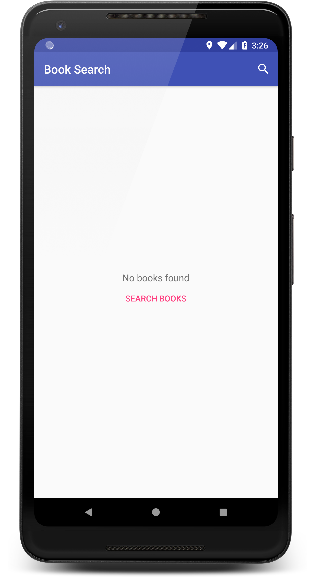
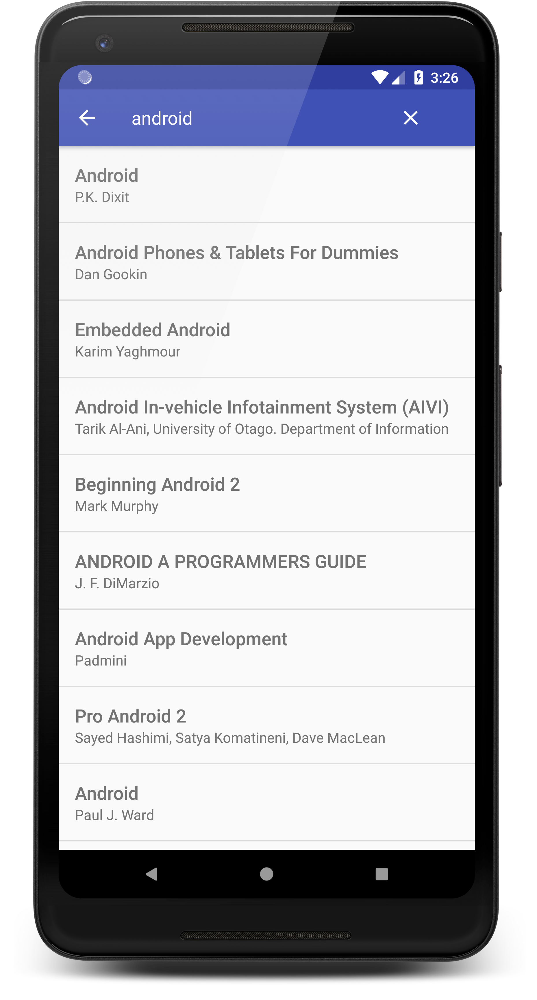

# Book Listing App

**Platform: Android (Min SDK: 19, Target SDK: 27)**

**Author: [Timotius Oktorio](https://ca.linkedin.com/in/timotiusoktorio "LinkedIn Profile") (toktorio@gmail.com)**

Simple Android app that can be used to search books from Google Play Books database using the Google Books API.

*This app is created as the seventh project of [Android Basics Nanodegree](https://www.udacity.com/course/android-basics-nanodegree-by-google--nd803) program at Udacity.*

### Features
- Search books by volume from Google Play Books database simply by entering a keyword.
- Lightweight and minimalist design. Support for book details will be added in future version.

### What I have learned from this project
- Fetching data from an API using Android HttpURLConnection API.
- Using AsyncTask to perform network operations in the background thread.
- Parsing a JSON response to get the required data for the model class.
- Creating a ListView that contains the data and display it to the user.

  

Get the apk file [here](https://github.com/toktorio/Book-Listing-App/blob/master/app/release/book-listing-app.apk?raw=true) to install the app on your device. Note that depending on your device settings, you might need to allow installation from unknown sources in order to install this app. Visit this [link](https://www.androidcentral.com/unknown-sources) for the detailed instructions.